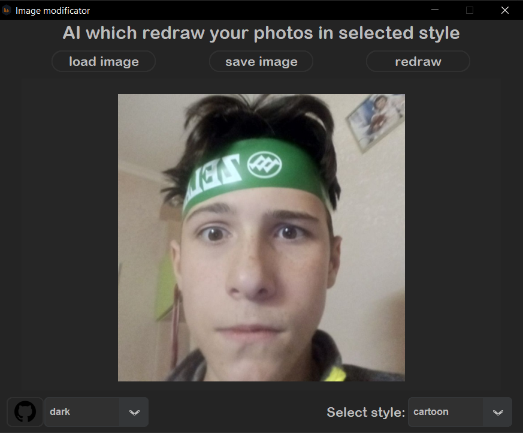

# Image re-drawer
This program re-draws your photos in a selected style(styles: cartoon, pixel-art, ASCII and coloured ASCII), with open-source code written in Python.

---
🎬What is it
Simple and understandable GUI.
If you want to change something in code you need to know how [CustomTkinter](https://github.com/TomSchimansky/CustomTkinter/wiki) and  [Tkinter](https://docs.python.org/3/library/tkinter.html) works and also Phyton.

