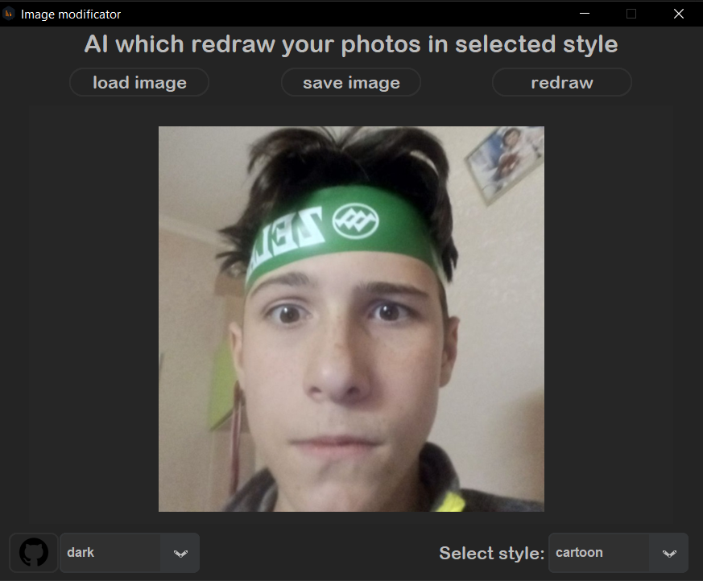
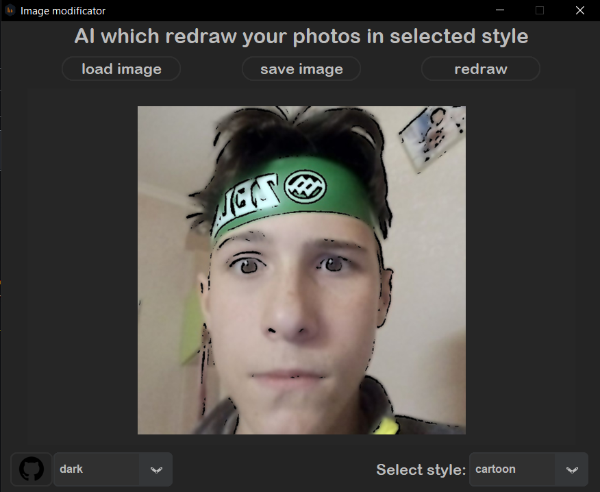
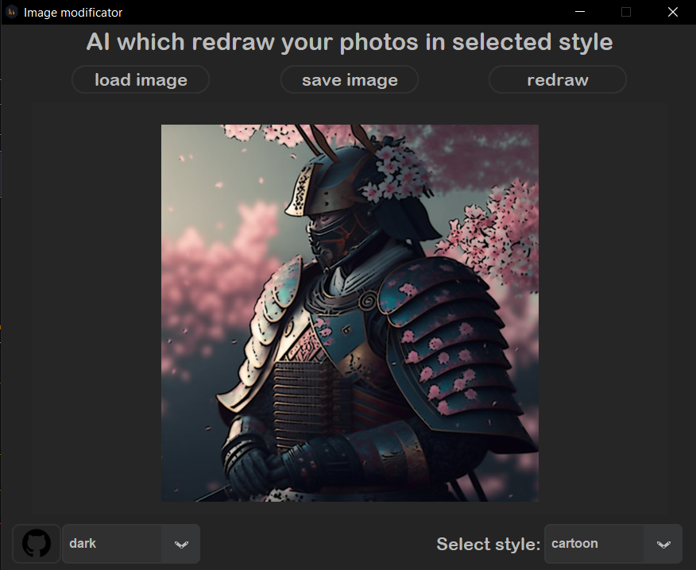
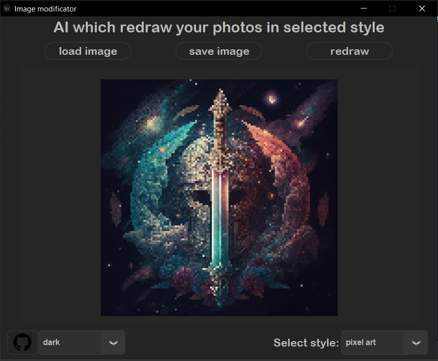
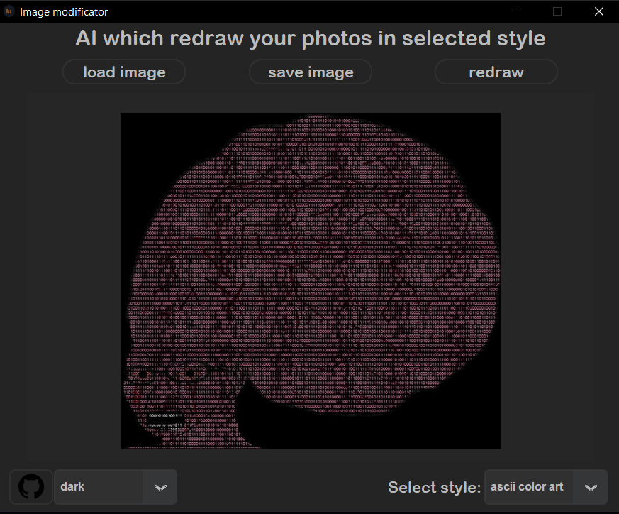
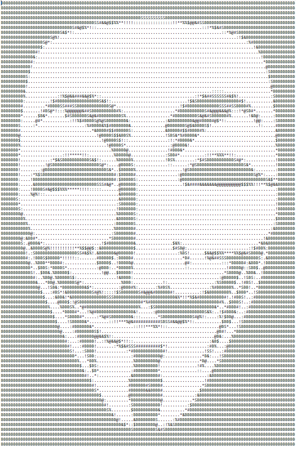

# Image re-drawer
This program re-draws your photos in a selected style(styles: cartoon, pixel-art, ASCII and coloured ASCII), with open-source code written in Python.

---
### 🎬What is it
Simple and understandable GUI.
If you want to change something in code you need to know how [CustomTkinter](https://github.com/TomSchimansky/CustomTkinter/wiki) and  [Tkinter](https://docs.python.org/3/library/tkinter.html) works and also Phyton.

⇓⇓⇓Cartoon style⇓⇓⇓

it's not a good image, for redrawing it to cartoon style. So⇓⇓⇓

that's better

⇓⇓⇓Pixel-art style⇓⇓⇓

⇓⇓⇓coloured ASCII style⇓⇓⇓

⇓⇓⇓ASCII style⇓⇓⇓

it'll be in the .txt file

---
### 🔨How to compile it
So firstly you need to download [python](https://www.python.org/downloads/). Then run Compile.bat and .exe file need to be in one directory with the files folder.

What need to be in "files" folder:

more [here](https://github.com/TomSchimansky/CustomTkinter/wiki/Packaging)

---
### ❌Builder errors

If you have error like this:

How to solve it read [here](https://www.stechies.com/pip-not-recognized-internal-external-command/)

---
### 📲Contacts
##### __Discord: 𝔰𝔦𝔩𝔳𝔢𝔯 𝔰𝔥𝔞𝔡𝔬𝔴#5304__

---
[go up](#up)
